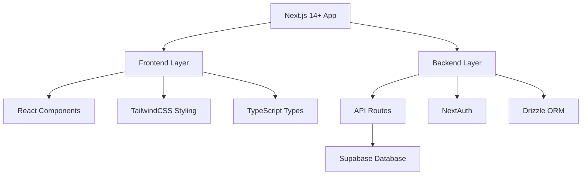
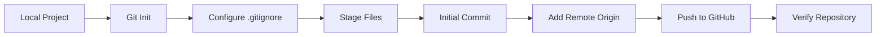
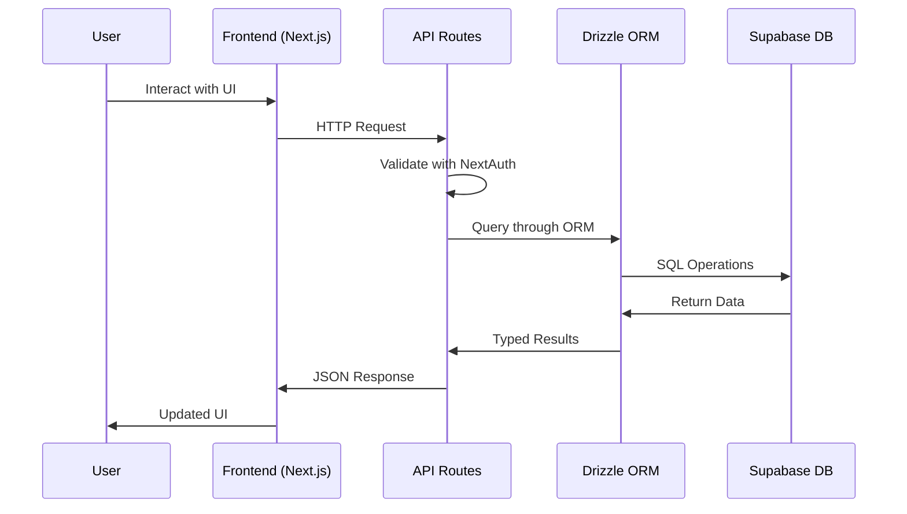

# Git Initialization & First Push Design

## Overview

This design document outlines the process for initializing Git version control for the C-Lab IQC Pro application and performing the first push to the GitHub repository at `https://github.com/thienchi2109/iqc-new.git`.

The project is a **Full-Stack Next.js Application** with the following characteristics:
- **Frontend**: Next.js 14+ with App Router, TypeScript, TailwindCSS
- **Backend**: Next.js API routes with Supabase Postgres database  
- **Authentication**: NextAuth with Credentials provider
- **ORM**: Drizzle with TypeScript
- **Deployment Target**: Vercel (frontend) + Supabase (database)

## Repository Analysis

### Project Type: Full-Stack Application

Based on the codebase structure analysis:
- Contains both frontend components (`app/`, `components/`) and backend API routes (`app/api/`)
- Uses modern JavaScript/TypeScript ecosystem with Next.js framework
- Includes database schema and ORM configuration
- Has comprehensive configuration files for build tools and deployment

### Technology Stack Assessment



## Architecture

### Git Workflow Architecture



### File Organization Strategy

| Category | Files | Git Handling |
|----------|-------|--------------|
| Source Code | `app/`, `components/`, `lib/`, `types/` | Commit |
| Configuration | `*.config.*`, `package.json`, `tsconfig.json` | Commit |
| Environment | `.env*` files | Ignore (except `.env.example`) |
| Dependencies | `node_modules/`, `pnpm-lock.yaml` | Lock file commit, modules ignore |
| Build Output | `.next/`, `dist/`, `*.tsbuildinfo` | Ignore |
| IDE Files | `.vscode/`, `*.swp`, `.DS_Store` | Ignore |

## Frontend Architecture

### Component Structure
```
components/
├── ui/                 # Base UI components
│   ├── Button.tsx
│   ├── Input.tsx
│   └── Select.tsx
├── HeaderNav.tsx       # Navigation component
├── Providers.tsx       # Context providers
└── StatusCard.tsx      # Dashboard components
```

### Application Routes
```
app/
├── (app)/             # Protected route group
│   ├── dashboard/     # Main dashboard
│   ├── quick-entry/   # QC data entry
│   ├── lj-chart/      # Levey-Jennings charts
│   └── reports/       # Reporting interface
├── auth/signin/       # Authentication pages
└── api/               # Backend API endpoints
```

## Backend Architecture

### API Endpoints Structure
```
api/
├── auth/[...nextauth]/ # NextAuth configuration
├── devices/           # Device management
├── methods/           # Test methods
├── qc/               # Quality control endpoints
│   ├── levels/       # QC levels management
│   ├── limits/       # Control limits
│   ├── lots/         # QC lot management
│   ├── run-groups/   # Test run grouping
│   └── runs/         # Individual QC runs
├── tests/            # Laboratory tests
└── units/            # Measurement units
```

### Database Schema Integration
- **ORM**: Drizzle with TypeScript
- **Database**: Supabase Postgres
- **Schema Location**: `lib/db/schema.ts`
- **Connection**: `lib/db/client.ts`

### Authentication Flow
- **Provider**: NextAuth Credentials
- **Session Management**: JWT tokens
- **Authorization**: Role-based access control
- **Middleware**: Route protection in `middleware.ts`

## Data Flow Between Layers



## Git Initialization Process

### Phase 1: Pre-initialization Setup

#### Environment File Preparation
```bash
# Create environment template if not exists
cp .env.local .env.example
# Remove sensitive values from .env.example
# Ensure .env.local is not committed
```

#### Required .gitignore Configuration
```gitignore
# Dependencies
node_modules/
pnpm-lock.yaml*

# Next.js build output
.next/
out/
build/
dist/

# Environment files
.env*
!.env.example

# IDE and OS files
.vscode/
.DS_Store
*.swp
*.swo

# Logs
npm-debug.log*
yarn-debug.log*
yarn-error.log*
pnpm-debug.log*

# TypeScript
*.tsbuildinfo
next-env.d.ts

# Drizzle
drizzle/
migrations/

# Vercel
.vercel

# Supabase
.supabase/
```

### Phase 2: Git Repository Initialization

#### Initialize Local Repository
```bash
cd /d/IQC-new
git init
git branch -M main
```

#### Configure Git User (if needed)
```bash
git config user.name "Your Name"
git config user.email "your.email@example.com"
```

### Phase 3: File Staging and Initial Commit

#### Stage Application Files
```bash
# Add all files respecting .gitignore
git add .

# Verify staged files
git status
```

#### Create Initial Commit
```bash
git commit -m "feat: initial commit for C-Lab IQC Pro application

- Next.js 14+ full-stack application with App Router
- Frontend: React components with TailwindCSS styling
- Backend: API routes with NextAuth authentication
- Database: Supabase integration with Drizzle ORM
- Features: QC management, Levey-Jennings charts, Westgard rules
- Configuration: TypeScript, ESLint, Tailwind setup"
```

### Phase 4: Remote Repository Setup

#### Add GitHub Remote
```bash
git remote add origin https://github.com/thienchi2109/iqc-new.git
```

#### Verify Remote Configuration
```bash
git remote -v
```

### Phase 5: First Push to GitHub

#### Push to Remote Repository
```bash
git push -u origin main
```

#### Verify Push Success
```bash
git log --oneline
git branch -vv
```

## Post-Initialization Configuration

### Repository Settings Verification

1. **Branch Protection**: Configure main branch protection rules
2. **Repository Description**: Set appropriate description for the QC management system
3. **Topics/Tags**: Add relevant topics (nextjs, typescript, quality-control, laboratory)
4. **README Update**: Ensure README.md reflects current project state

### Development Workflow Setup

#### Recommended Branch Strategy
```mermaid
gitgraph
    commit id: "Initial commit"
    branch develop
    checkout develop
    commit id: "Setup development"
    branch feature/qc-entry
    checkout feature/qc-entry
    commit id: "QC entry feature"
    checkout develop
    merge feature/qc-entry
    checkout main
    merge develop
```

#### Commit Message Conventions
```
feat: add new feature
fix: bug fix
docs: documentation changes
style: code style changes
refactor: code refactoring
test: add or update tests
chore: maintenance tasks
```

### Environment Configuration Workflow

1. **Development Setup**:
   - Copy `.env.example` to `.env.local`
   - Configure Supabase credentials
   - Set NextAuth secret

2. **Production Deployment**:
   - Configure Vercel environment variables
   - Set up Supabase production database
   - Configure domain and authentication URLs

## Verification Procedures

### Local Verification Checklist

- [ ] Git repository initialized successfully
- [ ] All source files staged and committed
- [ ] Environment files properly ignored
- [ ] Remote repository configured correctly
- [ ] Initial push completed without errors
- [ ] Repository visible on GitHub with correct files

### Remote Repository Validation

1. **File Structure Verification**: Ensure all application files are present
2. **Environment Security**: Confirm no sensitive files were committed
3. **Build Configuration**: Verify all configuration files are included
4. **Documentation**: Check README and specification files are available

### Development Readiness Test

```bash
# Clone repository to new location for testing
git clone https://github.com/thienchi2109/iqc-new.git test-clone
cd test-clone

# Install dependencies
pnpm install

# Verify build process
pnpm build

# Run development server
pnpm dev
```

## Risk Mitigation

### Security Considerations

| Risk | Mitigation | Verification |
|------|------------|-------------|
| Environment variables exposure | Comprehensive .gitignore | Check GitHub for .env files |
| Sensitive data in commits | Pre-commit hooks | Review commit history |
| Authentication secrets | Use .env.example template | Validate environment setup |

### Recovery Procedures

#### If Sensitive Data Committed
```bash
# Remove file from Git history
git filter-branch --force --index-filter \
'git rm --cached --ignore-unmatch path/to/sensitive/file' \
--prune-empty --tag-name-filter cat -- --all

# Force push to update remote
git push --force --all
```

#### Repository Reset (Emergency)
```bash
# Remove Git repository
rm -rf .git

# Reinitialize following this design
git init
# ... repeat initialization steps
```

## Testing Strategy

### Git Integration Testing

1. **Clone Test**: Verify repository can be cloned successfully
2. **Build Test**: Ensure application builds from fresh clone
3. **Dependency Test**: Confirm all dependencies install correctly
4. **Configuration Test**: Validate environment setup process

### Deployment Readiness

- [ ] Vercel deployment configuration present
- [ ] Supabase integration configured
- [ ] Environment variables documented
- [ ] Build process verified
- [ ] TypeScript compilation successful