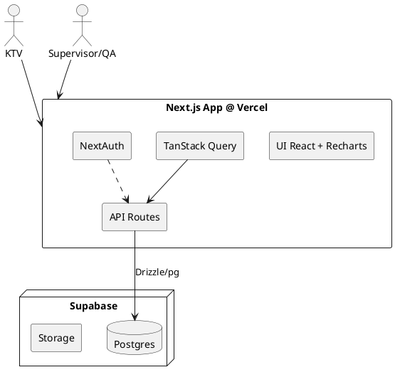

# SPEC-1-C-Lab IQC Pro

## Background

Các phòng xét nghiệm lâm sàng phải chạy mẫu kiểm soát nội bộ (IQC) hằng ngày cho từng thông số và từng máy để đảm bảo hệ thống đang đo chính xác/ổn định trước khi trả kết quả bệnh nhân. Thực hành phổ biến hiện nay là vẽ biểu đồ Levey–Jennings (L‑J) theo Mean/SD của từng lô QC và diễn giải dựa trên các quy tắc Westgard (1‑3s, 2‑2s, R‑4s, 4‑1s, 10x, 2of3‑2s, 3‑1s, 6x…) nhằm nhận diện sai số ngẫu nhiên, sai số hệ thống, các hiện tượng Shift/Trend.

Vấn đề thực tế:

- Nhập liệu & vẽ biểu đồ thủ công gây chậm, dễ sai; khó đồng bộ giữa nhiều máy, nhiều mức QC, nhiều lô.
- Việc áp dụng/ghi nhận vi phạm quy tắc không nhất quán giữa các KTV, dẫn đến bỏ sót cảnh báo hoặc báo động giả.
- Thiếu một kho dữ liệu tập trung để tổng hợp xu hướng, đánh giá theo tháng/quý, truy xuất bằng chứng khi đánh giá nội bộ/liên phòng/ISO 15189.
- Khó truy vết nguyên nhân và hành động khắc phục (CAPA) theo thời gian và theo từng máy/lô.

Mục tiêu của C‑Lab IQC Pro:

- Chuẩn hóa toàn bộ quy trình IQC, tự động tính Mean/SD, vẽ biểu đồ L‑J và kiểm tra đa quy tắc Westgard theo thời gian thực.
- Cảnh báo trực quan (đỏ/vàng/xanh), phát hiện sớm Shift/Trend, R‑4s, 2‑2s…; yêu cầu nhập CAPA và theo dõi trạng thái xử lý.
- Lưu trữ tập trung dữ liệu IQC (multiple machines/tests/levels/lots), phân quyền theo vai trò (KTV, Trưởng khoa, QL chất lượng, Admin), có nhật ký thao tác.
- Tạo báo cáo và số liệu thống kê phục vụ đánh giá nội bộ, liên phòng; xuất biểu đồ/báo cáo ở định dạng chuẩn (PDF/Excel).

---

## Requirements

### Phạm vi MVP đã chốt

- **Nhiều máy**, **nhiều xét nghiệm**, **1–3 mức QC/test**.
- **Nhập tay** điểm QC qua web UI (không kết nối thiết bị ở giai đoạn đầu).

### MoSCoW

**Must have (bắt buộc)**

- Quản lý danh mục: **Thiết bị (máy)**, **Xét nghiệm (test/analyte)**, **Mức QC** (L1/L2/L3), **Lô QC theo mức** (lot, **Expire Date**, ngày hiệu lực), **Đơn vị**.
- Cấu hình **giới hạn QC** cho từng *test × mức × lô*: **Mean**, **SD**, **%CV** (tự tính: `%CV = SD/Mean × 100`); hỗ trợ nhập từ nhà sản xuất hoặc do lab xác lập.
- Giao diện **nhập dữ liệu QC** theo run: *ngày/giờ, máy, test, mức, ****lô (theo mức)****, ****hạn dùng (Expire Date)****, ****phương pháp xét nghiệm****, ****đơn vị tính**** (enum, auto‑fill theo **test × máy**), ****giá trị đo****, ****người thực hiện****, ghi chú*.
- **Tự động tính**: Z‑score, vị trí so với Mean, mốc ±1/2/3SD.
- **Biểu đồ Levey–Jennings** theo *test × máy × mức × lô* với các đường Mean, ±1SD, ±2SD, ±3SD; tua theo ngày.
- **Bộ máy Westgard** (1‑3s, 1‑2s [cảnh báo], 2‑2s, R‑4s, 4‑1s, 10x; tuỳ chọn 7T/8x/12x) áp dụng ngay khi nhập; hiển thị **màu**: xanh/vàng/đỏ theo kết quả tự động.
- **Quy trình duyệt QC**: Tất cả QC run tạo ra ở trạng thái "chờ duyệt"; chỉ Trưởng khoa/QLCL/Admin mới có thể duyệt/từ chối.
- **Chấp nhận/Loại run sau duyệt**: Run được duyệt mới được tính là "valid QC" cho lịch sử; run chờ duyệt/từ chối không được tính.
- **CAPA bắt buộc**: Run auto\_result="fail" chỉ được duyệt nếu có CAPA đã duyệt hoặc có run tiếp theo PASS.
- **Báo cáo**: tỷ lệ vi phạm theo *máy/test/tháng*; nhật ký CAPA; xuất **Excel**.
- **Phân quyền**: KTV (nhập), Trưởng khoa/QLCL/Admin (duyệt QC), QLCL (báo cáo), Admin (cấu hình). Có **audit log đầy đủ**.
- **Ngôn ngữ giao diện**: mặc định **Tiếng Việt**; định dạng thời gian **Asia/Ho\_Chi\_Minh**; **dấu thập phân là dấu "."**.


**Should have (nên có)**

- Quản lý **bridge lot** (chuyển lô, so khớp Mean/SD giữa lô cũ–mới).
- **Tổng hợp 3 mức** trên cùng biểu đồ (tuỳ chọn bật/tắt); phát hiện **Shift/Trend** (10x/7T) ở mức tổng hợp.
- **Thông báo** in‑app khi run bị loại hoặc có xu hướng xấu.
- **Import Excel hàng loạt (từ xuất máy hoặc file thủ công) cho các ngày trước.**
- **Trình ký duyệt** (2 bước) cho CAPA quan trọng.

**Could have (có thể có)**

- **Mobile‑friendly** để xem biểu đồ và nhập nhanh.
- **Nhắc việc** (reminder) theo kế hoạch QC của từng máy.
- **Song ngữ VI/EN** toàn bộ UI.

**Won't have (chưa làm ở MVP)**

- **Kết nối tự động** trực tiếp tới analyzer/LIS (HL7/ASTM/host query) – sẽ thiết kế sẵn cổng mở rộng cho phase 2.
- **Phân tích nâng cao/ML** (tự động tối ưu SD, drift modeling).
- **Đa cơ sở** (nhiều chi nhánh đồng bộ real‑time trên cloud) – cân nhắc phase sau.

### Ràng buộc & phi chức năng

- **Hạ tầng Cloud (đã chốt)**: **Next.js** deploy trên **Vercel**; **Database: Supabase Postgres** (Storage). **Auth: NextAuth** (email/password Credentials; có thể mở rộng OIDC sau). **Supabase RLS: tắt**; kiểm soát truy cập ở lớp API/server. Sao lưu snapshot hằng ngày.
- **Bảo mật & tuân thủ**: đăng nhập bắt buộc (NextAuth); băm mật khẩu (Argon2/Bcrypt); phân quyền theo vai trò; **ủy quyền mức API** thay cho RLS; **audit trail** đầy đủ; đáp ứng truy xuất minh chứng theo **ISO 15189**.
- **Hiệu năng**: hiển thị biểu đồ L‑J < 1s cho tập dữ liệu 1 năm/test/mức; nhập 1 run < 3s; **caching & data fetching** dùng **TanStack Query** + revalidation theo ngữ cảnh.
- **Tính toàn vẹn**: không cho sửa dữ liệu đã duyệt; mọi chỉnh sửa phải có lý do & lưu phiên bản.
- **Khả năng mở rộng**: kiến trúc tách lớp; sẵn sàng thêm bộ kết nối thiết bị ở phase 2.


### UI/UX Guidelines (chốt)

- **Layout**: dùng **header navigation bar** (không sidebar) với logo trái, menu trung tâm/phải (Dashboard, Quick Entry, L‑J Chart, Reports, Settings), avatar menu người dùng.
- **Font**: **Inter** làm font chính (import bằng `next/font`), cỡ chữ cơ bản 14–16px, line-height 1.5.
- **Style**: Tailwind với bo góc `rounded-2xl`, bóng `shadow-md`, spacing tối thiểu `p-3`. Tông sáng (light) mặc định; dark mode optional.
- **Form**: input số dùng dấu thập phân **"."**, validate bằng Zod; enum chọn nhanh bằng Combobox/Select.
- **Bảng/Chart**: bảng virtualized nếu >1k dòng; Recharts cho L‑J với dot màu theo `status` và tooltip có badge tên rule.

## Method

### 1) Kiến trúc tổng thể (Vercel + Supabase, nhẹ & tối ưu nhập tay)

- **Frontend**: Next.js (App Router), **TanStack Query v5** (cache/invalidate), **Zod** (validate), Tailwind.
- **Biểu đồ**: **Recharts** (LineChart, ReferenceLine/Area, Customized dot, Brush, Tooltip) để vẽ **Levey–Jennings** (Mean, ±1/±2/±3SD, tooltip, zoom/pan) và tô màu theo trạng thái quy tắc.
- **Auth**: **NextAuth (Credentials)**, session **JWT**. Middleware bảo vệ `/app/*`. Vai trò: `tech` (KTV), `supervisor`, `qaqc`, `admin`.
- **Backend**: Next.js **Route Handlers** (runtime **node**, không edge cho API có DB). Service layer kiểm tra **Westgard** chạy server‑side.
- **DB**: **Supabase Postgres** (không RLS). Kết nối `pg` + **connection pooling** của Supabase. **Drizzle ORM** cho schema/migration. Backup hằng ngày.
- **File/Export**: Import/Export **Excel (SheetJS/xlsx)**; lưu file đính kèm CAPA vào Supabase Storage (nếu cần).

**Component Diagram (PlantUML)**



---

### 2) Lược đồ dữ liệu (Drizzle) – các bảng & ràng buộc chính

> Mỗi **run** = 1 lần nhập QC cho 1 *test × device × level × lot*. Nhóm nhiều mức cùng thời điểm vào **run\_group** để áp dụng **R‑4s** chuẩn.

- **users**: `id, email, name, role enum('tech','supervisor','qaqc','admin'), password_hash, is_active, created_at`.
- **devices**: `id, code, name, serial, manufacturer, model, department, is_active`.
- **tests**: `id, code, name, default_unit_id, default_method_id, decimals, is_active`.
- **units**: `id, code, display`. *(Dấu thập phân dùng ****.****)*
- **methods**: `id, code, name` *(Enzymatic/ISE/Immunoassay…)*.
- **qc\_levels**: `id, test_id FK, level enum('L1','L2','L3'), material, is_active`.
- **qc\_lots**: `id, level_id FK, lot_code, expire_date, effective_from, effective_to, supplier, notes`.
- **qc\_limits**: `id, test_id, level_id, lot_id, device_id, mean, sd, cv, source enum('manufacturer','lab'), created_by`.
  - **Unique** `(test_id, level_id, lot_id, device_id)`.
- **run\_groups**: `id, device_id, test_id, run_at timestamptz, created_by` *(gom các mức đo cùng giờ)*.
- **qc\_runs**: `id, group_id FK?, device_id, test_id, level_id, lot_id, value, unit_id, method_id, performer_id, status enum('pending','accepted','rejected'), auto_result enum('pass','warn','fail'), approval_state enum('pending','approved','rejected') DEFAULT 'pending', approved_by FK users(id), approved_at timestamptz, approval_note text, z, side enum('above','below','on'), notes, created_at`.
  - **Index** `(test_id, device_id, level_id, lot_id, created_at)`, `(approval_state, created_at)`, `(auto_result, created_at)`.
- **violations**: `id, run_id, rule_code, severity enum('warn','fail'), window_size, details JSONB, created_at`.
  - **Index** `(run_id, rule_code)`.
- **capa**: `id, run_id, root_cause, action, approver_id, status enum('draft','submitted','approved','rejected'), created_at`.
- **audit\_log**: `id, actor_id, action, entity, entity_id, diff JSONB, at`.
- **rule\_profiles**: `id, name, enabled_rules JSONB, scope enum('global','test','device')` (bật/tắt 7T, 8x/10x/12x…).

**Drizzle snippet (rút gọn minh hoạ)**

```ts
export const qcLimits = pgTable('qc_limits', {
  id: uuid('id').primaryKey().defaultRandom(),
  testId: uuid('test_id').notNull(),
  levelId: uuid('level_id').notNull(),
  lotId: uuid('lot_id').notNull(),
  deviceId: uuid('device_id').notNull(),
  mean: numeric('mean',{precision:12,scale:4}).notNull(),
  sd: numeric('sd',{precision:12,scale:4}).notNull(),
  cv: numeric('cv',{precision:6,scale:2}).notNull(), // sd/mean*100
  source: text('source').$type<'manufacturer'|'lab'>().notNull(),
});
```

---

### 3) Thuật toán Westgard & Levey–Jennings (server‑side)

**Chuẩn hoá**

- `%CV = SD/Mean * 100` (tự động khi tạo `qc_limits`).
- `z = (value - mean) / sd`; `side = sign(value - mean)`
- Kiểm tra hạn **expire\_date** của `lot` trước khi chấp nhận.

**Đánh giá quy tắc cho một run mới**

- Lấy **cửa sổ trượt** các `z` gần nhất theo *test × device × level × lot* (mặc định 12 điểm) và **các mức trong cùng **`` cho **R‑4s**.
- Quy tắc mặc định (MVP): `1-3s` (fail), `1-2s` (warn), `2-2s` (fail), `R-4s` (fail), `4-1s` (fail), `10x` (fail), `7T` (fail). Các rule khác bật qua `rule_profiles`.

**Pseudocode**

```ts
const limit = await findLimit(test, level, lot, device);
const z = (value - limit.mean) / limit.sd;
const lastZ = await lastZs({test, device, level, lot}, 12);
const peers = await groupPeers(groupId); // cho R-4s
const vios: Violation[] = [];
if (Math.abs(z) > 3) vios.push({rule:'1-3s',severity:'fail'});
if (Math.abs(z) > 2) vios.push({rule:'1-2s',severity:'warn'});
if (lastZ[0] && sameSide(z,lastZ[0]) && Math.abs(z)>2 && Math.abs(lastZ[0])>2)
  vios.push({rule:'2-2s',severity:'fail'});
if (existsOppositeWithDelta(peers,z,4)) vios.push({rule:'R-4s',severity:'fail'});
if (nOnOneSide([z,...lastZ],4,1)) vios.push({rule:'4-1s',severity:'fail'});
if (consecutiveOneSide([z,...lastZ],10)) vios.push({rule:'10x',severity:'fail'});
if (trendUpOrDown([z,...lastZ],7)) vios.push({rule:'7T',severity:'fail'});
const status = vios.some(v => v.severity==='fail') ? 'rejected' : 'accepted';
```

**Hiển thị trên L‑J (Recharts)**

- Trục Y: giá trị; vẽ các dải ±1/2/3SD; chấm dữ liệu tô **xanh/vàng/đỏ** theo `auto_result`.
- **Dot style**: rỗng (hollow) cho `approval_state='pending'`, đặc (solid) cho đã duyệt/từ chối.
- Tooltip: `value`, `z`, `auto_result`, `approval_state`, `rule` vi phạm, `performer`, `lot`, `expire`.
- Lọc: *device/test/level/lot/date range* + `approval_state`/`auto_result`; tuỳ chọn overlay 3 mức (Should‑have).

---

### 4) Quy tắc quyền hạn & nghiệp vụ

- **KTV**: nhập run; xem L‑J của máy/test mình.
- **Supervisor**: duyệt/loại run; yêu cầu/duyệt **CAPA**.
- **QA/QC**: báo cáo, cấu hình rule profile; quản lý bridge lot.
- **Admin**: quản trị hệ thống, danh mục, người dùng.
- **Audit**: tất cả thao tác ghi `audit_log` (ai, lúc nào, thay đổi gì).

### 5) Validation & hiệu năng

- **Zod** validate payload API; sanitize đầu vào số theo **dấu thập phân “.”**.
- **TanStack Query**: `staleTime` dài cho danh mục; `invalidate` khi tạo run/duyệt CAPA; **pagination/virtualization** cho bảng run.
- **Index** như trên để truy vấn nhanh cửa sổ 12 điểm & lọc theo ngày.


### (Cập nhật) Biểu đồ L‑J dùng **Recharts**

- Thay **uPlot** bằng **Recharts**: dùng `LineChart`, `ReferenceLine/ReferenceArea` để vẽ Mean và các dải ±1/±2/±3SD; `Customized` cho dot tô màu theo `status`; `Brush` để tua theo ngày; `Tooltip` hiển thị z‑score, rule vi phạm, performer.

## Implementation

### 1) Công nghệ & phiên bản

- **Next.js 14+ (App Router)**, **TypeScript**; **TanStack Query v5**; **NextAuth (Credentials)**; **Drizzle ORM + drizzle‑kit**; **Supabase Postgres** (no RLS, dùng policy ở API); **Recharts** cho L‑J; **Zod** validate; **SheetJS (xlsx)** cho xuất Excel.

### 2) Migrations & seed (Drizzle)

- Khởi tạo `schema.ts` theo các bảng ở Method; tạo **unique**/index như đã nêu.
- Seed danh mục mẫu: `units`, `methods`, 1–2 `tests`, 1–2 `devices`, `qc_levels`, `qc_lots`, `qc_limits` (có `mean/sd/cv`).

### 3) API Routes (Next.js)

- `POST /api/auth/login` (NextAuth Credentials) – trả JWT session.
- `POST /api/tests`, `POST /api/devices`, `POST /api/units`, `POST /api/methods` – Admin.
- `POST /api/qc/limits` – tạo/ cập nhật Mean/SD/%CV theo *test×level×lot×device*.
- `POST /api/qc/lots` – tạo lot (level‑scoped) + `expire_date`.
- `POST /api/qc/run-groups` – tạo nhóm giờ cho phiên đo.
- `POST /api/qc/runs` – nhập run: tính `z`, kiểm **Westgard**, trả `auto_result`+`violations`; tất cả run tạo ra ở `approval_state='pending'`.
- `GET /api/qc/runs` – lọc theo *device/test/level/lot/date range* + `approval_state`/`auto_result` (phục vụ bảng & chart).
- `POST /api/qc/runs/:id/approve` – duyệt QC run (chỉ supervisor/qaqc/admin); kiểm tra business rule cho `auto_result='fail'`.
- `POST /api/qc/runs/:id/reject` – từ chối QC run với lý do bắt buộc (chỉ supervisor/qaqc/admin).
- `POST /api/qc/capa` – tạo/duyệt CAPA.
- `GET /api/qc/violations` – liệt kê vi phạm theo filter.
- `GET /api/reports/summary` – tỷ lệ vi phạm theo máy/test/tháng; **Excel**: `GET /api/export/excel`.
- `POST /api/rule-profiles` – bật/tắt rule (`1-3s, 1-2s, 2-2s, R-4s, 4-1s, 10x, 7T, 2of3-2s, 3-1s, 6x`), scope `within_level|across_levels`.

### 4) Service “WestgardEngine”

- Hàm `evaluateRun({testId, deviceId, levelId, lotId, groupId, value})`:
  1. Lấy `qc_limits` ⇒ `mean/sd/cv` ⇒ `z`, `side`.
  2. Tải **cửa sổ** 12 điểm gần nhất theo *test×device×level×lot*; nếu có `groupId` thì tải **peers** (các mức khác trong cùng run) cho **R‑4s**/`2of3‑2s`.
  3. Áp dụng các rule được bật trong `rule_profiles` theo **scope**:
     - *Within‑level*: `1-3s`, `1-2s(warn)`, `2-2s`, `4-1s`, `10x`, `7T`, `3-1s`, `6x`.
     - *Across‑levels (cùng run\_group)*: `R-4s`, `2of3-2s`, `3-1s`, `6x` (bắt chéo L1/L2/L3).
  4. Lưu `qc_runs` + `violations (involved_result_ids)` trong 1 transaction; trả `status`.

### 5) Component L‑J (Recharts) – phác thảo

```tsx
<ResponsiveContainer width="100%" height={360}>
  <LineChart data={points} margin={{ top: 16, right: 24, left: 8, bottom: 8 }}>
    <CartesianGrid strokeDasharray="3 3" />
    <XAxis dataKey="t" />
    <YAxis />
    {/* Dải SD */}
    <ReferenceArea y1={mean-3*sd} y2={mean+3*sd} opacity={0.1} />
    <ReferenceLine y={mean} strokeDasharray="4 2" />
    <ReferenceLine y={mean+sd} /><ReferenceLine y={mean-sd} />
    <ReferenceLine y={mean+2*sd} /><ReferenceLine y={mean-2*sd} />
    <ReferenceLine y={mean+3*sd} /><ReferenceLine y={mean-3*sd} />
    <Line type="monotone" dataKey="value" dot={<ColoredDot />} />
    <Tooltip content={<LjTooltip />} />
    <Brush dataKey="t" height={24} />
  </LineChart>
</ResponsiveContainer>
```

### 6) Quyền & bảo mật

- **NextAuth** Credentials; hash **bcrypt/argon2**; middleware bảo vệ `/app/*` theo vai trò. Tất cả API kiểm **role** + **ownership** ở server (thay cho RLS). Ghi **audit\_log** cho thao tác quan trọng.

### 7) Kiểm thử

- **Unit test** cho từng rule: 1‑3s, 2‑2s, R‑4s, 4‑1s, 10x, 7T, 2of3‑2s, 3‑1s, 6x; test **across‑levels** (L1/L2/L3) theo cùng `run_group`.
- **Integration test** API `/api/qc/runs` (transaction + rollback). Snapshot biểu đồ (Chromatic/Playwright) ở mức đơn giản.

### 8) CI/CD & triển khai

- GitHub Actions: `pnpm i`, `pnpm lint`, `pnpm test`, build Next.js; deploy **Vercel** via token; chạy `drizzle-kit push` tới Supabase.
- **Backup**: Supabase automated backups hằng ngày; script `pg_dump` theo tuần.

### 9) Vận hành

- Chính sách dữ liệu: không xóa cứng `qc_runs`; `status` + `audit_log` cho sửa/thu hồi.
- Dashboard cảnh báo: thẻ *Warning/Fail* theo máy/test; quick link mở biểu đồ L‑J đã lọc đúng.


## Milestones

**M1 – Khởi tạo dự án & nền tảng**

- Repo, cấu hình Next.js (App Router), TypeScript, Tailwind, ESLint/Prettier.
- Kết nối Supabase Postgres; thiết lập Drizzle ORM + `drizzle-kit`.
- NextAuth (Credentials) + roles (`tech|supervisor|qaqc|admin`).
- Seed danh mục cơ bản: units, methods, devices, tests, qc\_levels.

**M2 – Quản trị danh mục & hạn mức QC**

- CRUD: devices/tests/units/methods.
- `qc_levels`, `qc_lots` (lot theo mức, **expire\_date**), `qc_limits` (Mean/SD/%CV, auto-calculated).
- Rule profile mặc định (bật: `1-3s, 1-2s(warn), 2-2s, R-4s, 4-1s, 10x, 7T`).

**M3 – Nhập QC & đánh giá quy tắc (WestgardEngine)**

- Form Quick Entry (auto-fill đơn vị & phương pháp theo test×máy; chọn lot theo mức; nhập performer).
- Tạo `run_groups`; lưu `qc_runs` trong transaction; tính `z`, ghi `violations`, trạng thái **accepted/warn/rejected**.
- Yêu cầu CAPA khi rejected; nhật ký audit.

**M4 – Biểu đồ Levey–Jennings (Recharts)**

- Vẽ Mean, ±1/2/3SD (ReferenceArea/Line), dot tô **xanh/vàng/đỏ** theo `status`.
- Tooltip hiển thị giá trị, z, rule vi phạm, performer, lot/expire.
- Brush để tua theo ngày; filter theo device/test/level/lot/date range.

**M5 – Dashboard & Báo cáo**

- Dashboard tổng quan warning/fail theo máy/test; liên kết mở L‑J đã lọc.
- Báo cáo tỷ lệ vi phạm theo tháng (Excel).

**M6 – Bảo mật, Logging, CI/CD**

- Middleware bảo vệ `/app/*`; kiểm tra quyền ở API (thay cho RLS).
- Audit log đầy đủ; backup Supabase; GitHub Actions + deploy Vercel.
- Tài liệu hướng dẫn sử dụng (VN) và checklist tuân thủ ISO 15189.

**M7 – Kiểm thử & UAT**

- Unit test cho từng rule (within-level & across-levels via run\_group).
- Integration test API; kiểm thử hiệu năng (render chart < 1s; nhập run < 3s).
- UAT với người dùng lab; chốt thay đổi cho MVP.

## Gathering Results

**Tiêu chí chấp nhận (Acceptance Criteria)**

- **Độ đúng quy tắc**: 100% case test chuẩn (bộ dữ liệu mô phỏng) được gắn đúng `violations` & `status` như kỳ vọng.
- **Hiệu năng**: thời gian render L‑J cho 12–18 tháng dữ liệu/test/mức < **1 giây** trên máy văn phòng; nhập 1 run < **3 giây**.
- **Tính toàn vẹn**: không sửa được run đã duyệt; mọi sửa có `audit_log`.
- **Trải nghiệm nhập liệu**: KTV nhập 3 mức trong 1 run\_group < **60 giây** (điền tự động & enum hoạt động đúng).

**Chỉ số vận hành (KPIs)**

- Tỷ lệ run **rejected** giảm sau khi áp dụng CAPA (so với baseline tháng đầu).
- Tỷ lệ **warning (1‑2s)** được theo dõi/giải quyết trong 24 giờ.
- Số lần vi phạm **R‑4s** giảm theo quý.

**Quy trình đánh giá sau triển khai**

1. **Dry‑run**: chạy lại 1–2 tháng dữ liệu cũ để đối chiếu biểu đồ & rule.
2. **Song song**: vận hành hệ thống mới song song ghi tay trong 2 tuần.
3. **Đánh giá**: họp QA/Trưởng khoa tổng kết, điều chỉnh `rule_profiles` nếu cần.
4. **Chuẩn hoá**: ban hành SOP nội bộ dùng C‑Lab IQC Pro cho IQC hằng ngày.

